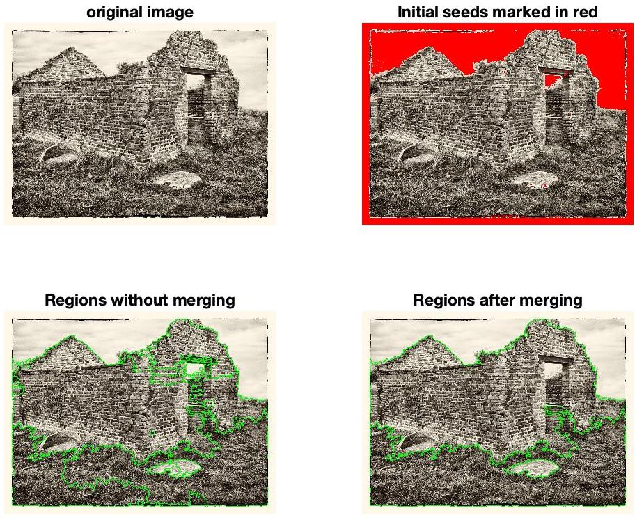
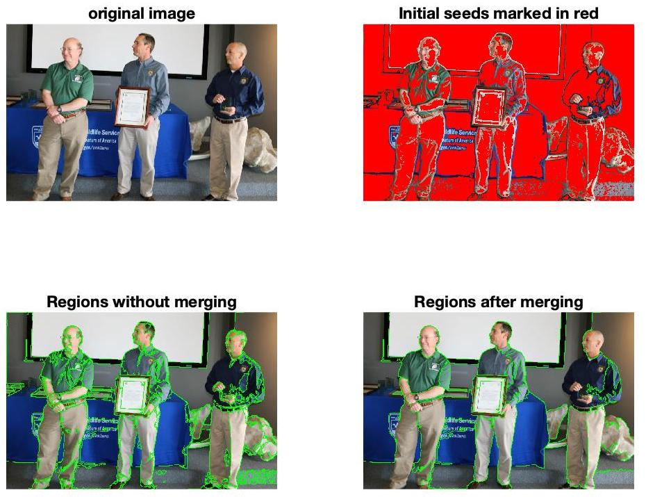
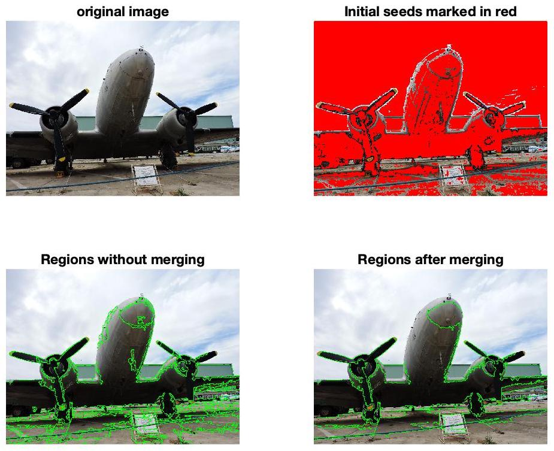
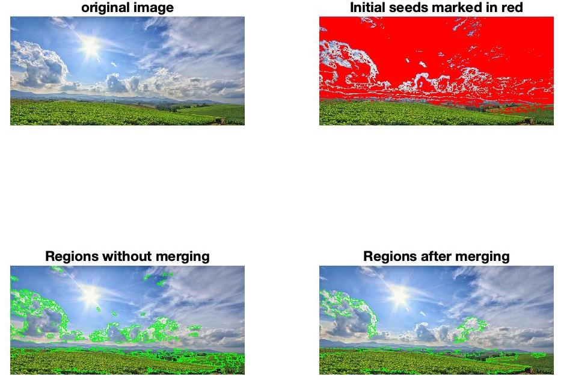
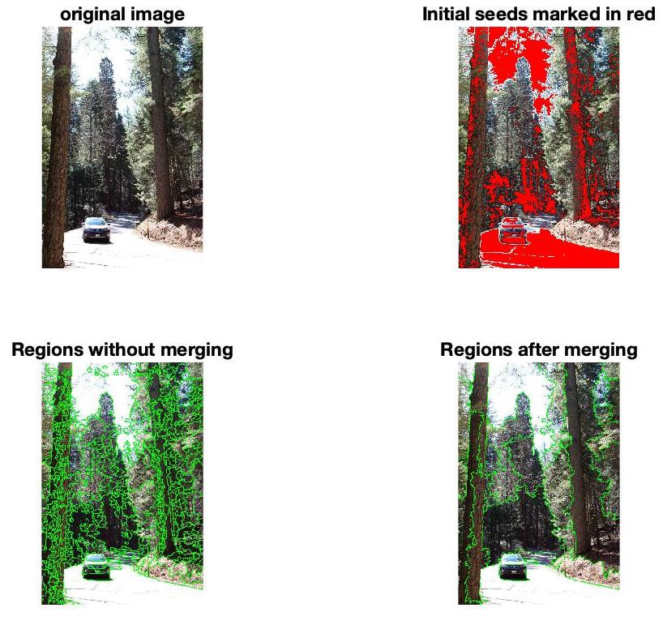
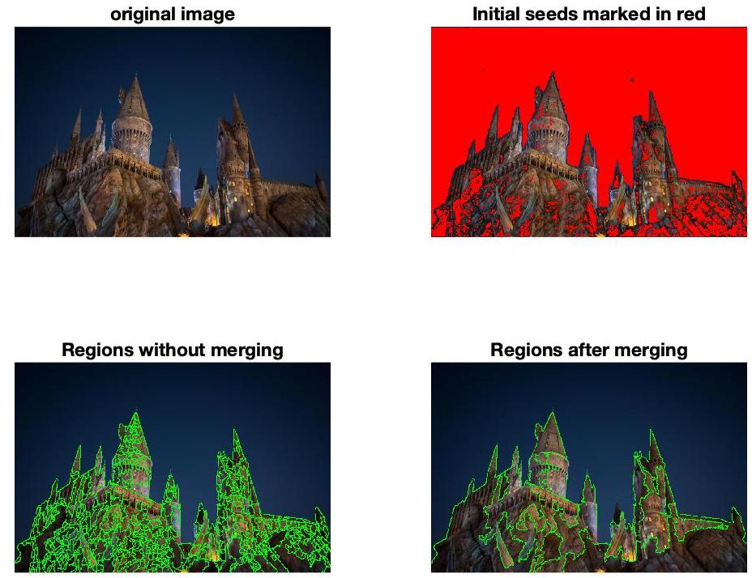
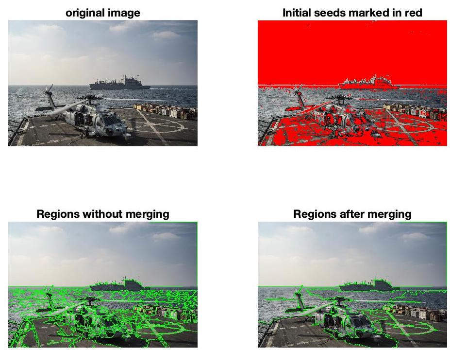
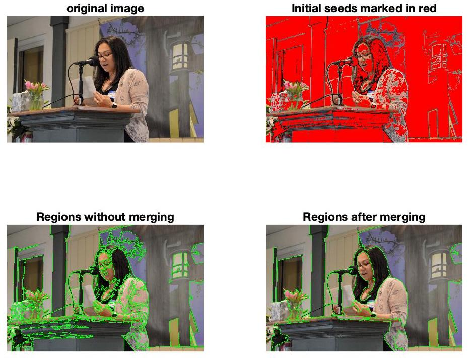

# Notable Results 
--
The write up for the rest of the project is in the README.docx / README.pdf file

-------
**underneath each image, the final similarity and size thresholds are given. Each image was initially merged with the similarity threshold of 0.1 and size of 1/150 of the total image size**

similarity: 0.1, size: 1/150 I used this image as one way to verify that my method worked. If there were bugs, one way they would have manifest themselves is by improperly merging the distinct colors. 

----

similarity: 0.2, size: 1/80

----

similarity: 0.15, size: 1/100

----

similarity: 0.1, size: 1/100

----

similarity: 0.1, size: 1/100

----

similarity: 0.14, size: 1/60

----

similarity: 0.17, size: 150

-----

similarity: 0.1, size: 1/15

-----
# The following results use 0.1 and 1/150 for the thresholds without further merging

----

----

----

-----

----

----

----

----

----

----

----

----

----

----

----

----

----

----

----
